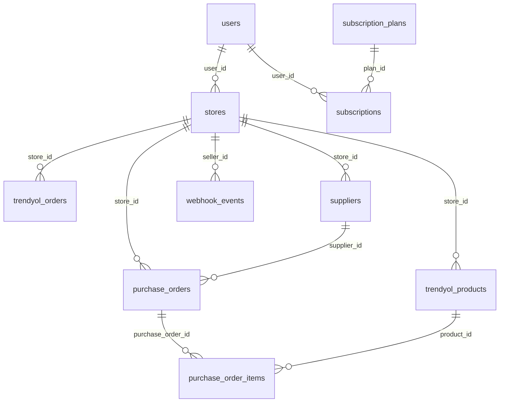

# Şema Özeti (Mevcut Kod)

Veritabanı ana tabloları, ilişkiler ve JSONB kolonlar. Kaynak: `01-migration-list.md`, `02-entity-table-map.md`.

## Ana Tablolar

| Tablo | Açıklama |
|-------|----------|
| users | Kullanıcı hesapları, rol, seçili mağaza, referral, preferences (JSONB). |
| stores | Mağaza tanımları, Trendyol credentials (JSONB), webhook, sync durumu, sync_phases (JSONB). |
| trendyol_products | Ürün kataloğu, maliyet/stok geçmişi cost_and_stock_info (JSONB). |
| trendyol_orders | Siparişler, order_items (JSONB), financial_transactions (JSONB), komisyon alanları. |
| webhook_events | Trendyol webhook kayıtları, event_id (unique), payload. |
| purchase_orders / purchase_order_items | Satın alma siparişleri, tedarikçi ve ürün FK. |
| trendyol_invoices, trendyol_deduction_invoices, trendyol_cargo_invoices, trendyol_payment_orders, trendyol_stoppages | Finansal/fatura/kesinti verileri. |
| subscription_plans, subscription_prices, subscriptions, invoices | Abonelik ve faturalama. |
| alert_rules, alert_history | Kural ve geçmiş. |
| stock_tracked_products, stock_snapshots, stock_alerts | Stok takibi. |
| return_records, trendyol_claims | İade ve talepler. |
| education_videos, video_watch_history | Eğitim videoları ve izleme. |
| activity_logs | Kullanıcı aksiyon logu, details (JSONB). |

## İlişkiler (Özet)

- **users** → stores (1:N, `stores.user_id`), subscriptions, payment_methods, invoices, feature_usage, billing_addresses, video_watch_history, user_notifications, support_tickets, activity_logs, alert_rules; referral: referrer / referred.
- **stores** → trendyol_products, trendyol_orders, trendyol_invoices, store_expenses, purchase_orders, suppliers, return_records, trendyol_claims, alert_rules, stock_tracked_products, store_ai_settings, store_knowledge_base, TrendyolQuestion/KnowledgeSuggestion/QaPattern/ConflictAlert.
- **purchase_orders** → purchase_order_items, po_attachments; FK: store_id, supplier_id.
- **suppliers** → store_id.
- **trendyol_products** → purchase_order_items (product_id), stock_tracked_products.
- **stock_tracked_products** → stock_snapshots, stock_alerts.
- **alert_rules** → alert_history.
- **subscriptions** → subscription_events, invoices; plan_id → subscription_plans.

## JSONB Kolonlar

| Tablo | Kolon | Not |
|-------|--------|-----|
| users | preferences | Kullanıcı tercihleri. |
| stores | credentials | Trendyol API anahtarları (hassas). |
| stores | sync_phases | Onboarding/sync faz bilgisi. |
| trendyol_products | cost_and_stock_info | Maliyet ve stok geçmişi. |
| trendyol_orders | order_items | Sipariş kalemleri. |
| trendyol_orders | financial_transactions | Finansal özet/transaction bilgisi. |
| trendyol_invoices | details | Fatura detayı. |
| webhook_events | payload | Webhook gövdesi (JSONB veya TEXT). |
| activity_logs | details | Aksiyon detayı. |

## Flyway

- **Konum:** `sellerx-backend/src/main/resources/db/migration/`
- **Sıra:** V1 → V84 (ardışık numaralar; V12 dahil 84 dosya).
- **Not:** Numaralar kesintisiz değil; tüm mevcut migration'lar `01-migration-list.md` içinde listelenir.
